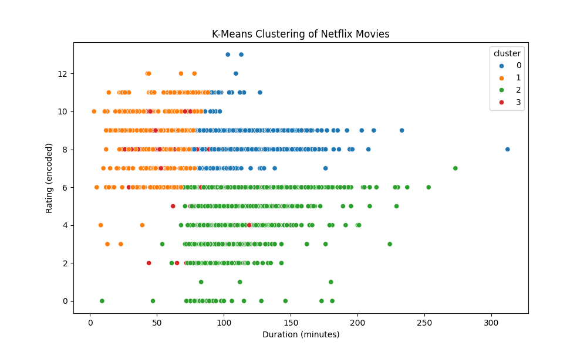

# 🎬 Netflix Show Clustering

This project applies **K-Means Clustering** on Netflix's movie data to group similar shows based on:

- 🎭 Genre (simplified to main genre)
- 🔞 Rating (encoded)
- ⏱️ Duration (in minutes)

We visualize the clusters using Seaborn and save the output as an image and CSV.

---

## 📁 Dataset

Used the [Netflix Titles dataset](https://www.kaggle.com/datasets/shivamb/netflix-shows) from Kaggle.  
Only **Movies** were included for consistent duration data.

---

## 💻 Tech Stack

- Python
- Pandas
- scikit-learn
- Seaborn
- Matplotlib

---

## 📊 Output Example



---

## 🧪 How to Run

1. Clone the repo:
   ```bash
   git clone https://github.com/DevOuttaHere/netflix_clustering.git
   cd netflix_clustering
